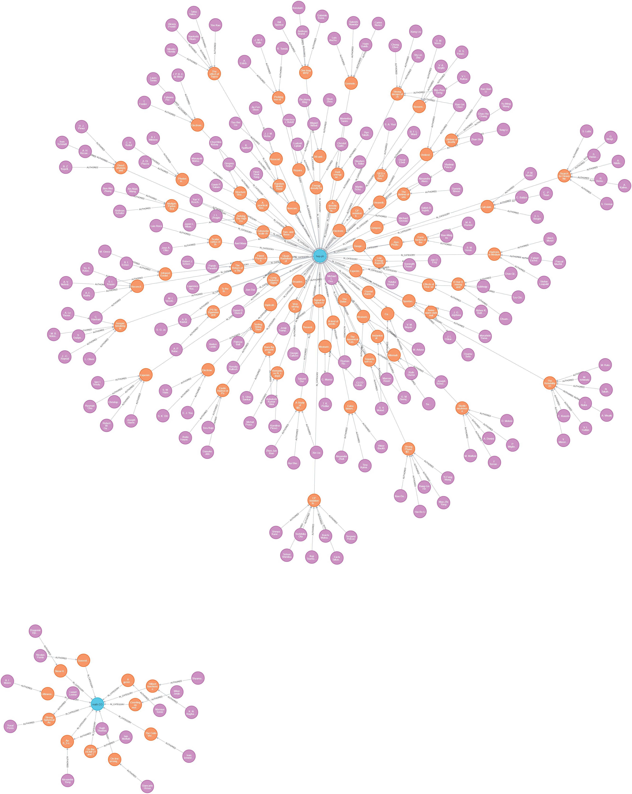

# neo4j-python

The neo4j database was populated with Cypher queries using python. The script main.py was run indorder to populate the database .

The following query was run to vizualize the database:

```MATCH (a:Author)-[:AUTHORED]->(p:Paper)-[:IN_CATEGORY]->(c:Category) RETURN a, p, c LIMIT 300; ```

Output :


